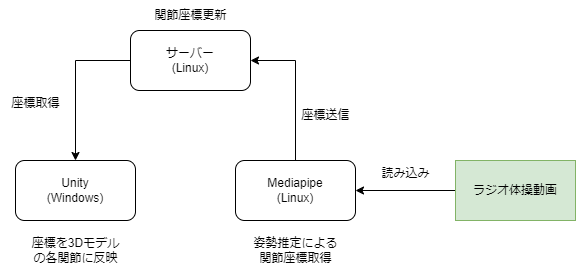

# Motion-capture-system-using-MediaPipe

MediaPipeを用いて姿勢推定を行い，Unity上の3Dモデルに取得した関節座標を付与することでモーションキャプチャーを行うシステムです．

## 概要

このシステムはMediaPipeという映像から人の姿勢推定を行うシステムを用いて映像内の人の関節座標を取得し，HTTP通信を用いてUnity上の3Dモデルに関節座標を付与することでモーションキャプチャーを行うシステムです．単眼カメラや動画などのさまざまな映像から姿勢推定を行うことができます．

システムの流れとしてMediaPipeで1フレームごとに姿勢推定を行い，HTTP通信を用いてサーバーに座標を送信します．サーバー上で値が更新されたらUnityでその座標を受信し，Unity上の各関節にその座標を与えることでモーションキャプチャーを行っています．

このシステムは姿勢推定を行う「[Motion-capture-system-using-MediaPipe/pose_post_yolo.py](https://github.com/TasitenREL/Motion-capture-system-using-MediaPipe/blob/main/pose_post_yolo.py)」とサーバーの「[Automatic-3D-model-extraction-system-using-LiDAR-and-object-surface-attributes/http_server_json.py](https://github.com/TasitenREL/Motion-capture-system-using-MediaPipe/blob/main/http_server_json.py)」とUnityで3Dモデルを動かす「[Automatic-3D-model-extraction-system-using-LiDAR-and-object-surface-attributes/humanPos.cs](https://github.com/TasitenREL/Motion-capture-system-using-MediaPipe/blob/main/humanPos.cs)」の3つコードで動作しています．

## 期間
2ヶ月

## 言語
言語：Python，C#

## 開発環境
個人開発でUnityを動かすWindowsとMediaPipeとサーバーを動かすLinuxで開発を行いました．

## 制作背景
趣味として作成しました．近年Virtual Youtuberなどが話題になっていますが，同じことをやるためにはモーションキャプチャー用のセンサーを付ける必要があるため，容易にモーションキャプチャーを行えるようにしたいと考えました．本システムは人型3Dモデルを動かせるわけではなく，立方体を各関節と見なして，各立方体を円柱でつなぐことで人型3Dモデルを表現しています．本来はボーンなどが入った人型3Dモデルで行いたいのですが，難しかったためこのようなシステムになりました．現在も少しずつ開発を続けており，逆運動学などを学んでいずれボーンが入った人型3Dモデルでモーションキャプチャを行えるようにしたいと考えています．
Unityは少ししか触ったことが無かったため，Unityの勉強にとても良い機会になりました．

## 動作風景URL
動作している様子を撮影しました．Youtubeの[ラジオ体操動画](https://www.youtube.com/watch?v=yQ7Oo9IUN7s)からモーションキャプチャーを行っており，緑の立方体の関節を赤い円柱でつなぐことで人を表現しています．

Unity上3Dモデルの様子URL:[https://www.youtube.com/watch?v=EhEjuchXWuI](https://www.youtube.com/watch?v=EhEjuchXWuI)

姿勢推定の様子URL:[https://www.youtube.com/watch?v=8p_74dOSpkI](https://www.youtube.com/watch?v=8p_74dOSpkI)
